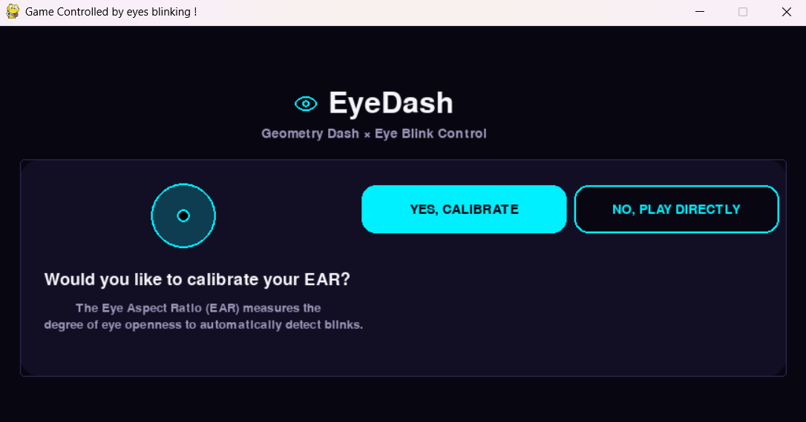

# eyeControl
 
A webcam-based blink detector that tells left-eye, right-eye, and dual blinks apart in real time — Used in a game driven by blinking eyes.

<!-- TODO: add a GIF or screenshot here showing the webcam window with the eye contours and a live blink being detected. This is the single highest-impact thing missing from this README right now — a wall of text with no visual loses most readers in the first few seconds. Screen-record a 5-10 second clip of a blink triggering a console print, convert to GIF (ScreenToGif or ezgif.com works fine), drop it in the repo, and reference it here: -->
<!--  -->

 
## Try it
 
No hosted demo — this needs a physical webcam, so it runs locally. See Quick start below.
 
## Quick start
 
```
pip install mediapipe opencv-python pygame
python EyeDash.py
```
 
Answer `YES, CALIBRATE` at the question to calibrate the EAR thresholds on your own eyes (10 seconds), or `NO, PLAY DIRECTLY` to use the defaults.
 
## Features
 
- Real-time blink detection from a live webcam feed using MediaPipe Face Landmarker (478 facial landmarks).
- Per-eye Eye Aspect Ratio (EAR) computation — detects each eye independently rather than treating "eyes" as one signal.
- Distinguishes dual blinks (both eyes) from single-eye blinks (left or right only).
- Optional personal calibration: 5 seconds eyes-open + 5 seconds eyes-closed to compute a threshold tailored to your own eye shape, instead of a fixed value.
## Running it locally
 
- **Python**: 3.9+ (MediaPipe Tasks API requirement).
- **System dependency**: a working webcam accessible via OpenCV's default backend (`cv.CAP_DSHOW`, Windows-specific — see note below for other OSes).
- **Model file**: `face_landmarker.task` must sit at the project root. [Download here](https://ai.google.dev/edge/mediapipe/solutions/vision/face_landmarker#models) if it's not already in the repo.
- No environment variables or config files needed.
Start command:
```
python EyeDash.py
```
 
Note: `cv.VideoCapture(0, cv.CAP_DSHOW)` is Windows-specific. On macOS/Linux, drop the `cv.CAP_DSHOW` flag.
 
## How it works
 
Blink detection here isn't a single global threshold on "eyes closed" — each eye gets its own EAR value and its own calibrated threshold, computed as an interpolation between the person's own open-eye and closed-eye EAR (`threshold = open_EAR - k * (open_EAR - close_EAR)`, `k = 0.75`). This matters because a fixed threshold tuned on one person's eyes tends to misfire on people with different eye shapes or camera angles — calibrating per-user removes that failure mode.
 
Classifying *which* eye blinked (not just *that* a blink happened) is what makes a richer command vocabulary possible later: a left-only blink, a right-only blink, and a dual blink can each map to a different action, rather than collapsing every blink into a single "click" signal.
 
## Roadmap
 
- [ ] create the game and link the game controls.
- [ ] add nice UI
## Credits
 
Built with [MediaPipe](https://ai.google.dev/edge/mediapipe) (Google) and [OpenCV](https://opencv.org/).
