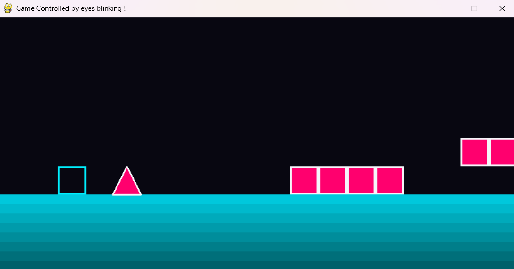

# eyeControl
 
A webcam-controlled game inspired by Geometry Dash, where the player uses eye blinks as the main input.

<!-- TODO: add a GIF or screenshot here showing the webcam window with the eye contours and a live blink being detected. This is the single highest-impact thing missing from this README right now — a wall of text with no visual loses most readers in the first few seconds. Screen-record a 5-10 second clip of a blink triggering a console print, convert to GIF (ScreenToGif or ezgif.com works fine), drop it in the repo, and reference it here: -->
<!--  -->

 
## Try it
 
No hosted demo — this needs a physical webcam, so it runs locally. See Quick start below.
 
## Quick start
 
```
pip install mediapipe opencv-python pygame
python EyeDash.py
```
 
When the program starts, choose `YES, CALIBRATE` to calibrate the EAR thresholds to your own eyes (10 seconds), or `NO, PLAY DIRECTLY` to use the default thresholds.
 
## Features
 
- Real-time blink detection from a live webcam feed using MediaPipe Face Landmarker (478 facial landmarks).
- Per-eye Eye Aspect Ratio (EAR) computation — detects each eye independently rather than treating "eyes" as one signal.
- Distinguishes dual blinks (both eyes) from single-eye blinks (left or right only).
- Optional personal calibration: 5 seconds eyes-open + 5 seconds eyes-closed to compute a threshold tailored to your own eye shape, instead of a fixed value.
- Pygame-based game with gravity, obstacles, platforms, collision detection and a game-over system.
- Blink-controlled gameplay — a single-eye blink triggers a jump.
## Running it locally
 
- **Python**: 3.9+ (MediaPipe Tasks API requirement).
- **System dependency**: a working webcam accessible via OpenCV's default backend (`cv.CAP_DSHOW`, Windows-specific — see note below for other OSes).
- **Model file**: `face_landmarker.task` must sit at the project root. [Download here](https://ai.google.dev/edge/mediapipe/solutions/vision/face_landmarker#models) if it's not already in the repo.
- No environment variables or config files needed.
Start command:
```
python EyeDash.py
```
 
Note: `cv.VideoCapture(0, cv.CAP_DSHOW)` is Windows-specific. On macOS/Linux, use `cv.VideoCapture(0)` instead.
 
## How it works
 
Blink detection isn't based on a single global threshold — each eye gets its own EAR value and its own calibrated threshold. The threshold is calculated from the person's own open-eye and closed-eye EAR values using `threshold = open_EAR - k * (open_EAR - close_EAR)`, with `k = 0.75`. 

During the game, the program counts how many frames each eye remains closed. If both eyes are closed for approximately the same amount of time, the event is classified as a dual blink. Otherwise, it is classified as a single-eye blink.

Single-eye blinks currently trigger the jump, while dual blinks are detected but do not yet have a gameplay action assigned. This leaves room for a richer control system where different blink patterns can trigger different actions.

## Game

EyeDash is inspired by Geometry Dash. The player must avoid spikes and use blocks as platforms while the obstacles move towards them.

The game currently includes gravity, jumping, moving obstacles, platforms, collision detection, a game-over state and a restart system. The obstacle speed can later be increased to progressively make the game harder.

## Roadmap
 
- [ ] Add procedural obstacles.
- [ ] Add progressive difficulty.
- [ ] Add a rotation when the player jump and particles.
- [ ] (Add more eye-based commands.) ?

## Credits
 
Built with [MediaPipe](https://ai.google.dev/edge/mediapipe) (Google), [OpenCV](https://opencv.org/) and [Pygame](https://www.pygame.org/).